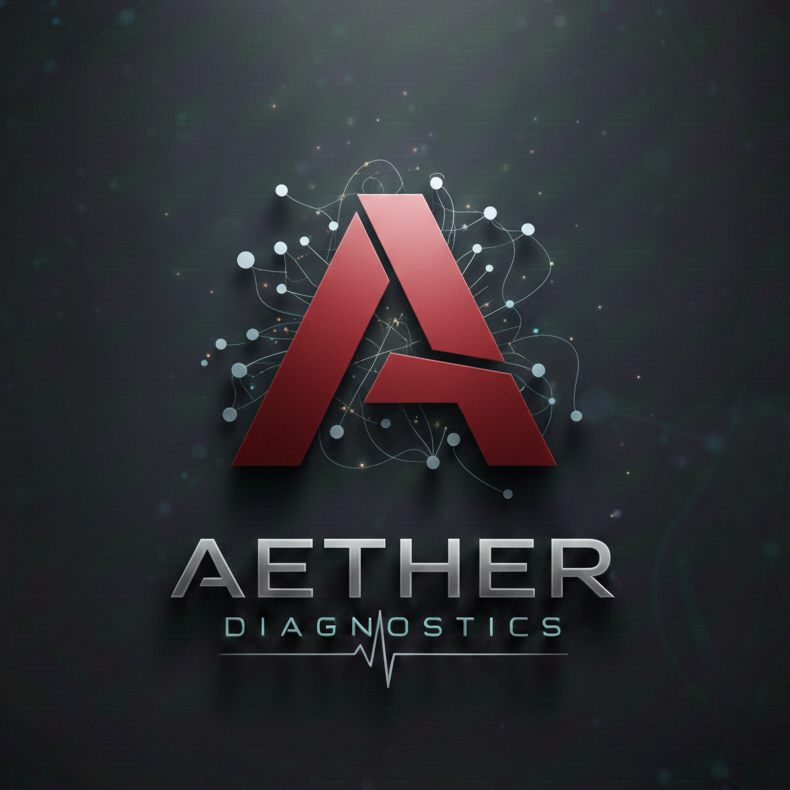

<p align="center">
  
</p>

<h1 align="center">AETHER DIAGNOSTICS</h1>

<p align="center">
  <strong>Autonomous Medical Intelligence & Vision-Language Diagnostics</strong><br>
  An Elite Engine by <b>Nocteon Inc.</b>
</p>

<p align="center">
  
  
  
</p>

---

## 📜 Project Overview
**AETHER** is a sophisticated medical AI system designed for high-fidelity X-ray analysis. Built under the **Nocteon Inc.** umbrella, it utilizes a local vision-language engine to identify abnormalities, fractures, and clinical pathologies in real-time.

## 🧠 Core Capabilities
* **Clinical Precision**: Specialized in skeletal trauma and thoracic anomalies.
* **No-Cloud Privacy**: Processes sensitive medical images locally to ensure data sovereignty.
* **Automated Reporting**: Generates "Nocteon-Standard" PDF reports with embedded visual evidence.
* **Smart Database**: Integrated GitHub portal for managing patient records via a structured cloud hierarchy.

## 🛠️ Tech Stack
* **Inference Engine**: Moondream2 (Optimized VLM)
* **Environment**: Google Colab
* **Data Management**: Git-backed Patient Portal
* **Reporting**: FPDF Pro-Reporting Logic

## 🏥 Clinical Protocols
| Protocol ID | Focus | Description |
| :--- | :--- | :--- |
| **01** | **Fracture Screen** | Automated detection of bone fissures and skeletal trauma. |
| **02** | **Pulmonary Audit** | Assessment of heart size and lung field clarity. |
| **03** | **Foreign Objects** | Scanning for surgical hardware or non-biological implants. |
| **04** | **Full Diagnostic** | Comprehensive medical audit of all visible anatomical structures. |

## 📂 Architecture
```text
AETHER/
├── data/
│   └── reports/        # Patient Diagnostic Records
├── moondream_final.bin # AI Engine Weights
├── AETHER_Master.py    # Main Analysis Loop
└── README.md           # Documentation
```
<p align="center"> <i>"Visionary Diagnostics for a Safer Tomorrow."</i>


<b>© 2026 Nocteon Inc. All Rights Reserved.</b> </p>
